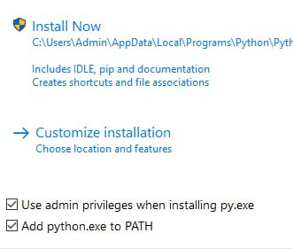
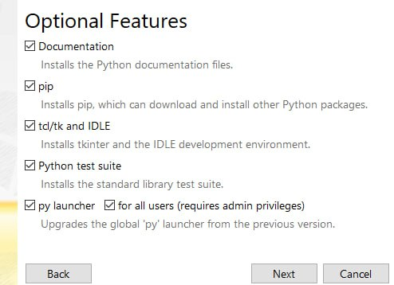
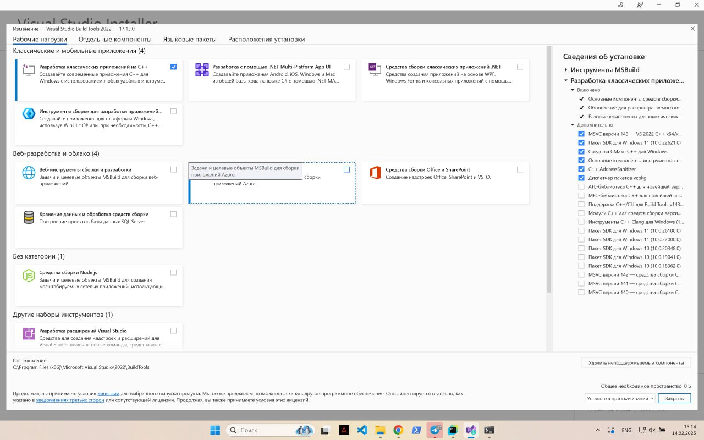

# Pion

SDK для управления дронами [geoscan pioneer base](https://geoscan.education/pioneer-base) по mavlink.

Дроны с модификацией ультразвуковой системы навигации [локус](https://www.geoscan.ru/ru/products/pioneer/locus) и
с raspberry pi zero 2w (модификация "Арена").

Перед установкой, убедитесь, что у вас установлен git:

- [Git](https://git-scm.com/downloads)

# Установка на Linux

## Автоматическая установка
Перейдите в папку с проектом и выполните команду:
```angular2html
sudo curl -sSL https://raw.githubusercontent.com/OnisOris/pion/refs/heads/dev/install_scripts/install_linux.sh | sudo bash
```

После выполнения скрипта активируйте виртуальное окружение 
```
source ./.venv/bin/activate
```

## Ручная установка

Вам необходимо установить build-essential:
```shell
sudo apt update
sudo apt install build-essential
```

Установка пакетов для расширений на C/C++:
```commandline
python3-dev
```

Если вы используете несистемный python, то вы должны поставить пакет для вашей версии python:
```commandline
python3.[номер версии]-dev
```

К примеру:
```commandline
python3.13-dev
```


## Через pip (на windows и linux)

```shell
pip install git+https://github.com/OnisOris/pion
```


# Установка на windows

## Автоматическая установка

Перейдите в папку со своим проектом через терминал и выполните команду

```angular2html
 powershell -NoProfile -ExecutionPolicy Bypass -Command "Invoke-WebRequest 'https://raw.githubusercontent.com/OnisOris/pion/refs/heads/dev/install_scripts/install_windows.bat' -OutFile 'install_windows.bat'; Start-Process 'install_windows.bat' -Verb RunAs"
```

Данная команда установит все необходимые библиотеки для сборки модуля

## Ручная установка

Установите python. Тесты проводились на версиях 3.9-3.13, но рекомендую ставить >3.13.
Важно, если у вас установлен python, проверьте, что необходимые библиотеки у вас есть, если же вы не уверены, переустановите 
python по инструкции.
- [Последняя версия python](https://www.python.org/downloads/)

Далее при установке поставьте галки, как на картинках, а также перейдите в Customize installation.

 

Доставьте все галки в "Advanced Options"


 

Здесь тоже доставьте галки


 

Проверьте, что у вас установлен vs build tools с нужными пакетами:



## Создание вирутального окружения
В терминале перейдите в ваш проект и выполните команду:

```commandline
python -m venv venv
```

После этого активируйте виртуальное окружение:
```commandline
venv\Scripts\activate.bat
```

## Установка pion

```shell
pip install git+https://github.com/OnisOris/pion
```


## Установка клонированием
Данный способ вам нужен, если вы хотите модифицировать моудль, для использования вам это не нужно, 
устанавливайте через pip.

Клонируем репозиторий:
```shell
git clone https://github.com/OnisOris/pion
```


Необходимо поставить следующие пакеты (при установленном и активированным виртуальном окружении по инструкции ниже
эти команды сработают для windows):
```shell
pip install numpy matplotlib pymavlink cython setuptools rich protobuf paramiko
```
Далее необходимо собрать cython модуль:
```
python setup.py build_ext --inplace
```

# Установка на mac os
## Автоматическая установка
Перейдите в папку с проектом и выполните команду:
```angular2html
curl -sSL https://raw.githubusercontent.com/OnisOris/pion/refs/heads/dev/install_scripts/install_macos.sh | bash
```

После выполнения скрипта активируйте виртуальное окружение 
```
source ./.venv/bin/activate
```


# Подключение
Для подключения к дрону достаточно создать экземпляр класса Pion

```python
from pion import Pion

ip = "127.0.0.1"
port = 8000
drone = Pion(ip=ip, mavlink_port=port)
```


# Подробное описание с примерами

- [Pion](docs/pion.md) - класс управления реальными дронами

- [Spion](docs/spion.md) - класс дрона-симулятора

- [Apion](docs/apion.md) - Класс с реализацией асинхронного управления

- [Simulator](docs/simulator.md) - Классы симуляторов

- [Pio](docs/pio.md) - Асбстрактные классы


Дополнительные примеры с инструкцией можно найти по ссылкам:

https://github.com/OnisOris/pion_examples

https://github.com/OnisOris/Danalysis


