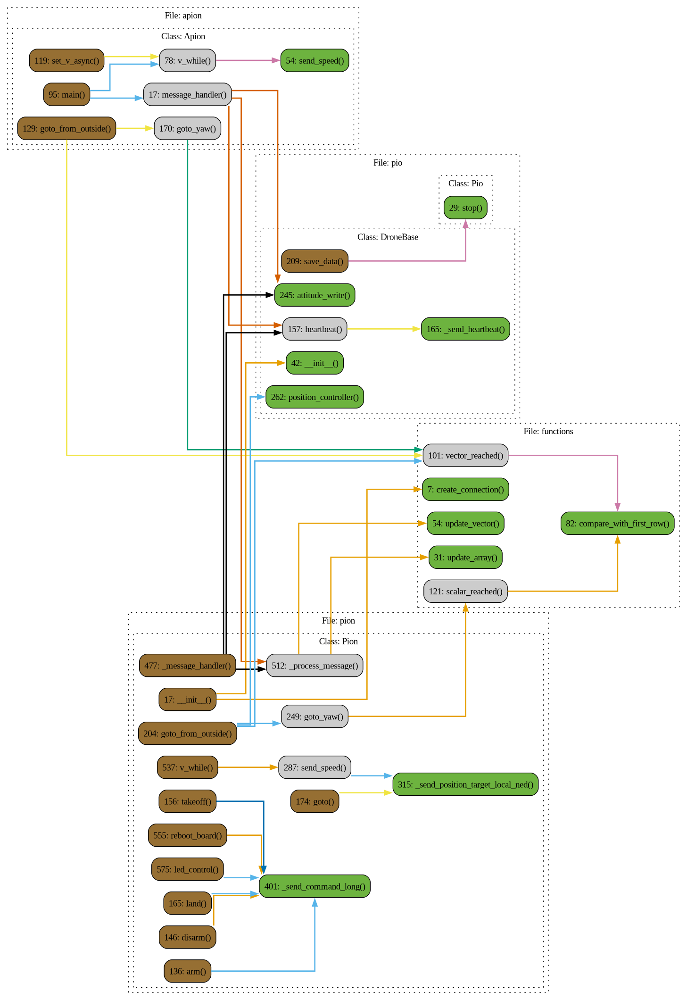

# Apion

## Описание

### Class: Apion

**Описание:** Асинхронная версия Pion

### Method: Apion.stop

**Описание:** Останавливает все асинхронные задачи внутри приложения. :return: None

### Function: stop

**Описание:** Останавливает все асинхронные задачи внутри приложения. :return: None

 Диаграмма потока

 