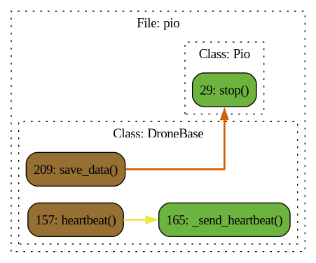

# Pio

## Описание

### Module

### Class: Pio

### Method: Pio.arm

### Method: Pio.disarm

### Method: Pio.takeoff

### Method: Pio.land

### Method: Pio.set_v

### Method: Pio.stop

### Method: Pio._send_heartbeat

**Описание:** Отправляет сообщение HEARTBEAT для поддержания активного соединения с дроном. :return: None

### Class: DroneBase

### Method: DroneBase.__init__

### Method: DroneBase.position

**Описание:** Сеттер для _position :return: None

### Method: DroneBase.xyz

**Описание:** Сеттер для _position :return: None

### Method: DroneBase.yaw

**Описание:** Геттер вернет yaw :return: np.ndarray

### Method: DroneBase.attitude

**Описание:** Сеттер для _attitude :return: None

### Method: DroneBase.heartbeat

**Описание:** Функция проверки heartbeat дрона :return: None

### Method: DroneBase._send_heartbeat

**Описание:** Отправляет сообщение HEARTBEAT для поддержания активного соединения с дроном. :return: None

### Method: DroneBase.goto_yaw

**Описание:** Берет целевую координату по yaw и вычисляет необходимые скорости для достижения целевой позиции, посылая их в управление t_speed. Для использования необходимо включить цикл v_while для посылки вектора скорости дрону. Максимальная скорость обрезается np.clip по полю self.max_speed.

#### Параметры:

- **yaw**: координата по yaw (радианы)
- **accuracy**: Погрешность целевой точки
### Method: DroneBase.led_control

**Описание:** Управление светодиодами на дроне.

#### Параметры:

- **led_id** (int): Идентификатор светодиода, который нужно управлять. Допустимые значения: 0, 1, 2, 3, 255.
- **r**: Значение интенсивности красного канала (от 0 до 255).
- **g**: Значение интенсивности зеленого канала (от 0 до 255).
- **b**: Значение интенсивности синего канала (от 0 до 255).
### Method: DroneBase.save_data

**Описание:** Функция для сохранения траектории в файл columns=['x', 'y', 'z', 'yaw', 'Vx', 'Vy', 'Vz', 'Vy_yaw', 'vxc', 'vyc', 'vzc', 'v_yaw_c', 't']

#### Параметры:

- **file_name**: название файла
- **path**: путь сохранения
### Method: DroneBase.check_battery

**Описание:** Проверяет статус батареи :return: None

### Method: DroneBase.reboot_board

**Описание:** Функция для перезагрузки дрона :return: None

### Method: DroneBase.attitude_write

**Описание:** Функция для записи траектории в numpy массив. Записывается только уникальная координата :return:

### Method: DroneBase.set_v

**Описание:** Создает поток, который вызывает функцию v_while() для параллельной отправки вектора скорости :return: None

### Method: DroneBase.position_controller

### Function: arm

### Function: disarm

### Function: takeoff

### Function: land

### Function: set_v

**Описание:** Создает поток, который вызывает функцию v_while() для параллельной отправки вектора скорости :return: None

### Function: stop

### Function: _send_heartbeat

**Описание:** Отправляет сообщение HEARTBEAT для поддержания активного соединения с дроном. :return: None

### Function: __init__

### Function: position

**Описание:** Сеттер для _position :return: None

### Function: xyz

**Описание:** Сеттер для _position :return: None

### Function: yaw

**Описание:** Геттер вернет yaw :return: np.ndarray

### Function: attitude

**Описание:** Сеттер для _attitude :return: None

### Function: heartbeat

**Описание:** Функция проверки heartbeat дрона :return: None

### Function: goto_yaw

**Описание:** Берет целевую координату по yaw и вычисляет необходимые скорости для достижения целевой позиции, посылая их в управление t_speed. Для использования необходимо включить цикл v_while для посылки вектора скорости дрону. Максимальная скорость обрезается np.clip по полю self.max_speed.

#### Параметры:

- **yaw**: координата по yaw (радианы)
- **accuracy**: Погрешность целевой точки
### Function: led_control

**Описание:** Управление светодиодами на дроне.

#### Параметры:

- **led_id** (int): Идентификатор светодиода, который нужно управлять. Допустимые значения: 0, 1, 2, 3, 255.
- **r**: Значение интенсивности красного канала (от 0 до 255).
- **g**: Значение интенсивности зеленого канала (от 0 до 255).
- **b**: Значение интенсивности синего канала (от 0 до 255).
### Function: save_data

**Описание:** Функция для сохранения траектории в файл columns=['x', 'y', 'z', 'yaw', 'Vx', 'Vy', 'Vz', 'Vy_yaw', 'vxc', 'vyc', 'vzc', 'v_yaw_c', 't']

#### Параметры:

- **file_name**: название файла
- **path**: путь сохранения
### Function: check_battery

**Описание:** Проверяет статус батареи :return: None

### Function: reboot_board

**Описание:** Функция для перезагрузки дрона :return: None

### Function: attitude_write

**Описание:** Функция для записи траектории в numpy массив. Записывается только уникальная координата :return:

### Function: position_controller

 Диаграмма потока

 