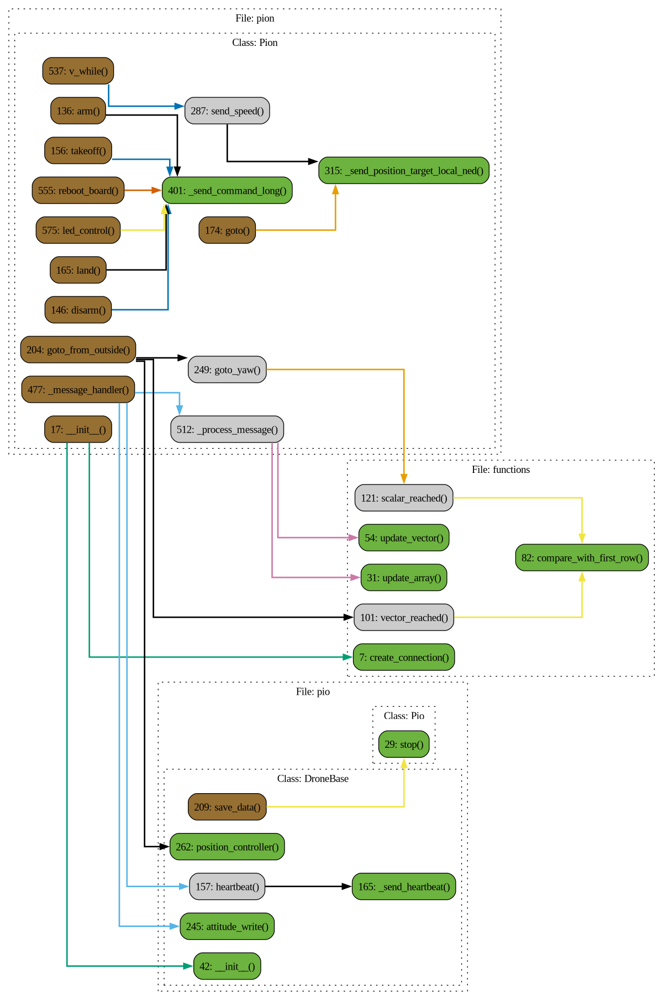

# Pion

## Описание

### Module

### Class: Pion

**Описание:** Класс Pion предназначен для управления дроном через протокол MAVLink. Он включает функционал для инициализации соединения, отправки команд дрону, обработки сообщений, и управления движением. Pion также поддерживает многопоточность для выполнения различных задач параллельно.

### Method: Pion.__init__

**Описание:** Инициализация класса Pion, устанавливающего MAVLink соединение с дроном  и управляющего взаимодействием по передаче и приему данных.

#### Параметры:

- **ip** (str): IP-адрес для подключения к дрону.
- **mavlink_port**: Порт для MAVLink соединения.
- **connection_method**: Метод соединения, например, 'udpout' для MAVLink.
- **combine_system**: Системный код для комбинированной системы управления: 1, 2, 3
- **count_of_checking_points**: Количество последних точек, используемых для проверки достижения цели.
- **name**: Название экземпляра
- **mass**: Масса дрона
- **dt**: Период приема всех сообщений с дрона
- **checking_components**: Параметр для проверки номеров компонентов. Отключается для в сторонних симуляторах
### Method: Pion.speed

**Описание:** Функция вернет скорость [vx, vy, vz] :return: Union[Array2, Array3]

### Method: Pion.arm

**Описание:** Включает двигатели :return: None

### Method: Pion.disarm

**Описание:** Отключает двигатели :return: None

### Method: Pion.takeoff

**Описание:** Взлет дрона :return: None

### Method: Pion.land

**Описание:** Посадка дрона :return: None

### Method: Pion.goto

**Описание:** Полет к указанной точке в текущей системе координат навигации.

#### Параметры:

- **x** (float | int): Координата по оси X в ENU (East-North-Up) системе координат.
- **y**: Координата по оси Y в ENU (East-North-Up) системе координат.
- **z**: Координата по оси Z (высота) в ENU (East-North-Up) системе координат.
- **yaw**: Угол курса, на который должен повернуться дрон. По умолчанию 0.

#### Возвращает:
- None
### Method: Pion.goto_from_outside

**Описание:** Функция берет целевую координату и вычисляет необходимые скорости для достижения целевой позиции, посылая их в управление t_speed. Для использования необходимо включить цикл v_while для посылки вектора скорости дрону. Максимальная скорость обрезается np.clip по полю self.max_speed.

#### Параметры:

- **x** (Union[float, int]): координата по x
- **y**: координата по y
- **z**: координата по z
- **yaw**: координата по yaw
- **accuracy**: Погрешность целевой точки 
### Method: Pion.goto_yaw

**Описание:** Функция берет целевую координату по yaw и вычисляет необходимые скорости для достижения целевой позиции, посылая их в управление t_speed. Для использования необходимо включить цикл v_while для посылки вектора скорости дрону. Максимальная скорость обрезается np.clip по полю self.max_speed.

#### Параметры:

- **yaw**: координата по yaw (радианы)
- **accuracy**: Погрешность целевой точки
### Method: Pion.send_speed

**Описание:** Функция задает вектор скорости дрону. Отсылать необходимо в цикле.

#### Параметры:

- **vx**: скорость по оси x (м/с)
- **vy**: скорость по оси y (м/с)
- **vz**: скорость по оси z (м/с)
- **yaw_rate**: скорость поворота по оси z (рад/с)
### Method: Pion._send_position_target_local_ned

**Описание:** Функция отправляет команду MAVLink для установки целевой позиции или скорости в локальной системе координат NED (North, East, Down).  Параметры включают систему координат, маску для указания активных полей, координаты (x, y, z), скорости (vx, vy, vz), ускорения и скорость поворота по оси yaw.

#### Параметры:

- **coordinate_system** (int): Система координат (например, NED).
- **x**: Координата x.
- **y**: Координата y.
- **z**: Координата z.
- **vx**: Скорость по оси x.
- **vy**: Скорость по оси y.
- **vz**: Скорость по оси z.
- **afx**: Ускорение по оси x.
- **afy**: Ускорение по оси y.
- **afz**: Ускорение по оси z.
- **yaw**: Угол курса.
- **yaw_rate**: Скорость изменения курса.
- **target_system**: Идентификатор целевой системы.
- **target_component**: Идентификатор целевого компонента.
- **mavlink_send_number**: Количество отправок команды.
### Method: Pion._send_command_long

**Описание:** Отправляет команду типа COMMAND_LONG через MAVLink.

#### Параметры:

- **command_name** (str): Имя команды для логирования.
- **command**: Команда MAVLink.
- **param1**: Параметр 1 команды.
- **param2**: Параметр 2 команды.
- **param3**: Параметр 3 команды.
- **param4**: Параметр 4 команды.
- **param5**: Параметр 5 команды.
- **param6**: Параметр 6 команды.
- **param7**: Параметр 7 команды.
- **target_system**: Идентификатор целевой системы.
- **target_component**: Идентификатор целевого компонента.
- **mavlink_send_number**: Количество отправок команды.
### Method: Pion._send_heartbeat

**Описание:** Отправляет сообщение HEARTBEAT для поддержания активного соединения с дроном. :return: None

### Method: Pion._message_handler

**Описание:** Обрабатывает сообщения от дрона и отправляет heartbeat, обновляя координаты дрона.

#### Параметры:

- **combine_system** (int): Определяет, с каких источников будут считываться данные:
### Method: Pion._process_message

**Описание:** Обрабатывает одно сообщение и обновляет данные (позиция, ориентация, батарея).

#### Параметры:

- **msg**: Сообщение MAVLink
- **src_component**: Источник данных, по которому фильтруется сообщение.
### Method: Pion.v_while

**Описание:** Функция задает цикл while на отправку вектора скорости в body с периодом period_send_v :return: None

### Method: Pion.set_v

**Описание:** Создает поток, который вызывает функцию v_while() для параллельной отправки вектора скорости :return: None

### Method: Pion.reboot_board

**Описание:** Функция для перезагрузки дрона :return: None

### Method: Pion.stop

**Описание:** Останавливает все потоки внутри приложения :return: None

### Method: Pion.led_control

**Описание:** Управление светодиодами на дроне.

#### Параметры:

- **led_id** (int): Идентификатор светодиода, который нужно управлять. Допустимые значения: 0, 1, 2, 3, 255.
- **r**: Значение интенсивности красного канала (от 0 до 255).
- **g**: Значение интенсивности зеленого канала (от 0 до 255).
- **b**: Значение интенсивности синего канала (от 0 до 255).
### Function: __init__

**Описание:** Инициализация класса Pion, устанавливающего MAVLink соединение с дроном  и управляющего взаимодействием по передаче и приему данных.

#### Параметры:

- **ip** (str): IP-адрес для подключения к дрону.
- **mavlink_port**: Порт для MAVLink соединения.
- **connection_method**: Метод соединения, например, 'udpout' для MAVLink.
- **combine_system**: Системный код для комбинированной системы управления: 1, 2, 3
- **count_of_checking_points**: Количество последних точек, используемых для проверки достижения цели.
- **name**: Название экземпляра
- **mass**: Масса дрона
- **dt**: Период приема всех сообщений с дрона
- **checking_components**: Параметр для проверки номеров компонентов. Отключается для в сторонних симуляторах
### Function: speed

**Описание:** Функция вернет скорость [vx, vy, vz] :return: Union[Array2, Array3]

### Function: arm

**Описание:** Включает двигатели :return: None

### Function: disarm

**Описание:** Отключает двигатели :return: None

### Function: takeoff

**Описание:** Взлет дрона :return: None

### Function: land

**Описание:** Посадка дрона :return: None

### Function: goto

**Описание:** Полет к указанной точке в текущей системе координат навигации.

#### Параметры:

- **x** (float | int): Координата по оси X в ENU (East-North-Up) системе координат.
- **y**: Координата по оси Y в ENU (East-North-Up) системе координат.
- **z**: Координата по оси Z (высота) в ENU (East-North-Up) системе координат.
- **yaw**: Угол курса, на который должен повернуться дрон. По умолчанию 0.

#### Возвращает:
- None
### Function: goto_from_outside

**Описание:** Функция берет целевую координату и вычисляет необходимые скорости для достижения целевой позиции, посылая их в управление t_speed. Для использования необходимо включить цикл v_while для посылки вектора скорости дрону. Максимальная скорость обрезается np.clip по полю self.max_speed.

#### Параметры:

- **x** (Union[float, int]): координата по x
- **y**: координата по y
- **z**: координата по z
- **yaw**: координата по yaw
- **accuracy**: Погрешность целевой точки 
### Function: goto_yaw

**Описание:** Функция берет целевую координату по yaw и вычисляет необходимые скорости для достижения целевой позиции, посылая их в управление t_speed. Для использования необходимо включить цикл v_while для посылки вектора скорости дрону. Максимальная скорость обрезается np.clip по полю self.max_speed.

#### Параметры:

- **yaw**: координата по yaw (радианы)
- **accuracy**: Погрешность целевой точки
### Function: send_speed

**Описание:** Функция задает вектор скорости дрону. Отсылать необходимо в цикле.

#### Параметры:

- **vx**: скорость по оси x (м/с)
- **vy**: скорость по оси y (м/с)
- **vz**: скорость по оси z (м/с)
- **yaw_rate**: скорость поворота по оси z (рад/с)
### Function: _send_position_target_local_ned

**Описание:** Функция отправляет команду MAVLink для установки целевой позиции или скорости в локальной системе координат NED (North, East, Down).  Параметры включают систему координат, маску для указания активных полей, координаты (x, y, z), скорости (vx, vy, vz), ускорения и скорость поворота по оси yaw.

#### Параметры:

- **coordinate_system** (int): Система координат (например, NED).
- **x**: Координата x.
- **y**: Координата y.
- **z**: Координата z.
- **vx**: Скорость по оси x.
- **vy**: Скорость по оси y.
- **vz**: Скорость по оси z.
- **afx**: Ускорение по оси x.
- **afy**: Ускорение по оси y.
- **afz**: Ускорение по оси z.
- **yaw**: Угол курса.
- **yaw_rate**: Скорость изменения курса.
- **target_system**: Идентификатор целевой системы.
- **target_component**: Идентификатор целевого компонента.
- **mavlink_send_number**: Количество отправок команды.
### Function: _send_command_long

**Описание:** Отправляет команду типа COMMAND_LONG через MAVLink.

#### Параметры:

- **command_name** (str): Имя команды для логирования.
- **command**: Команда MAVLink.
- **param1**: Параметр 1 команды.
- **param2**: Параметр 2 команды.
- **param3**: Параметр 3 команды.
- **param4**: Параметр 4 команды.
- **param5**: Параметр 5 команды.
- **param6**: Параметр 6 команды.
- **param7**: Параметр 7 команды.
- **target_system**: Идентификатор целевой системы.
- **target_component**: Идентификатор целевого компонента.
- **mavlink_send_number**: Количество отправок команды.
### Function: _send_heartbeat

**Описание:** Отправляет сообщение HEARTBEAT для поддержания активного соединения с дроном. :return: None

### Function: _message_handler

**Описание:** Обрабатывает сообщения от дрона и отправляет heartbeat, обновляя координаты дрона.

#### Параметры:

- **combine_system** (int): Определяет, с каких источников будут считываться данные:
### Function: _process_message

**Описание:** Обрабатывает одно сообщение и обновляет данные (позиция, ориентация, батарея).

#### Параметры:

- **msg**: Сообщение MAVLink
- **src_component**: Источник данных, по которому фильтруется сообщение.
### Function: v_while

**Описание:** Функция задает цикл while на отправку вектора скорости в body с периодом period_send_v :return: None

### Function: set_v

**Описание:** Создает поток, который вызывает функцию v_while() для параллельной отправки вектора скорости :return: None

### Function: reboot_board

**Описание:** Функция для перезагрузки дрона :return: None

### Function: stop

**Описание:** Останавливает все потоки внутри приложения :return: None

### Function: led_control

**Описание:** Управление светодиодами на дроне.

#### Параметры:

- **led_id** (int): Идентификатор светодиода, который нужно управлять. Допустимые значения: 0, 1, 2, 3, 255.
- **r**: Значение интенсивности красного канала (от 0 до 255).
- **g**: Значение интенсивности зеленого канала (от 0 до 255).
- **b**: Значение интенсивности синего канала (от 0 до 255).

 Диаграмма потока

 