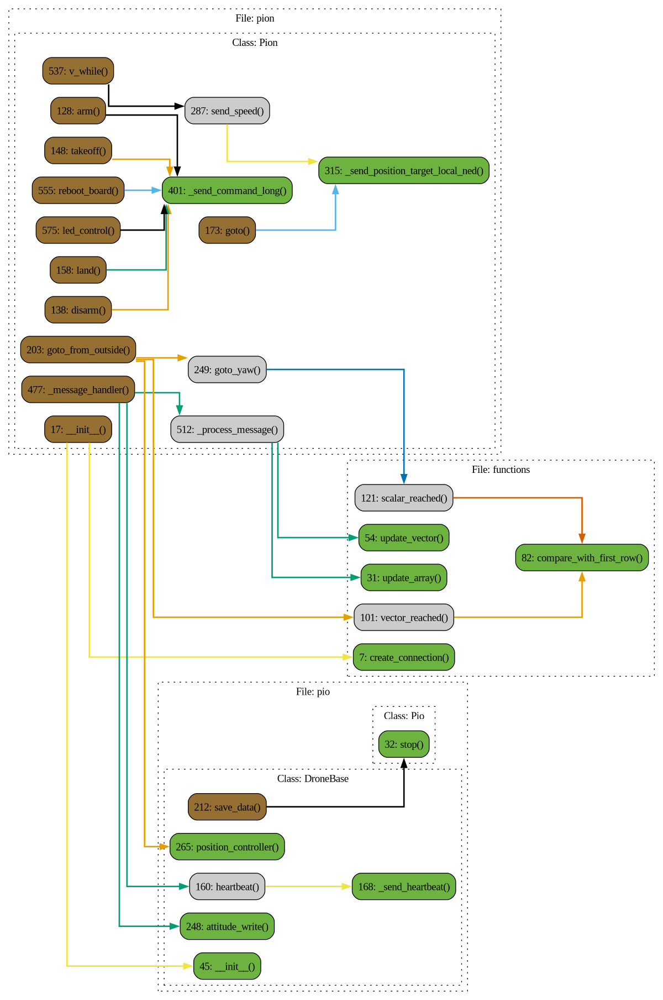

# Файл pion.py

## Класс: Pion

Описание: Класс Pion предназначен для управления дроном через протокол MAVLink. Он включает функционал для инициализациисоединения, отправки команд дрону, обработки сообщений, и управления движением. Pion также поддерживаетмногопоточность для выполнения различных задач параллельно.

### Функция: Pion.__init__

Описание: Инициализация класса Pion, устанавливающего MAVLink соединение с дрономи управляющего взаимодействием по передаче и приему данных.

Параметры:

- **ip** 

  Описание: IP-адрес для подключения к дрону.

  Тип: str

- **mavlink_port** 

  Описание: Порт для MAVLink соединения.

  Тип: int

- **connection_method** 

  Описание: Метод соединения, например, 'udpout' для MAVLink.

  Тип: str

- **combine_system** 

  Описание: Системный код для комбинированной системы управления: 1, 2, 3

  Тип: int

- **count_of_checking_points** 

  Описание: Количество последних точек, используемых для проверки достижения цели.

  Тип: int

- **name** 

  Описание: Название экземпляра

  Тип: str

- **mass** 

  Описание: Масса дрона

  Тип: float

- **dt** 

  Описание: Период приема всех сообщений с дрона

  Тип: float

- **checking_components** 

  Описание: Параметр для проверки номеров компонентов. Отключается для в сторонних симуляторахво избежание ошибок.

  Тип: bool

### Функция: Pion.speed

Описание: Функция вернет скорость [vx, vy, vz]

Возвращает: Union[Array2, Array3]

### Функция: Pion.arm

Описание: Включает двигатели

Возвращает: None

### Функция: Pion.disarm

Описание: Отключает двигатели

Возвращает: None

### Функция: Pion.takeoff

Описание: Взлет дрона

Возвращает: None

### Функция: Pion.land

Описание: Посадка дрона

Возвращает: None

### Функция: Pion.goto

Описание: Полет к указанной точке в текущей системе координат навигации.

Параметры:

- **x** 

  Описание: Координата по оси X в ENU (East-North-Up) системе координат.

  Тип: float | int

- **y** 

  Описание: Координата по оси Y в ENU (East-North-Up) системе координат.

  Тип: float | int

- **z** 

  Описание: Координата по оси Z (высота) в ENU (East-North-Up) системе координат.

  Тип: float | int

- **yaw** 

  Описание: Угол курса, на который должен повернуться дрон. По умолчанию 0.

  Тип: float | int, optional

Возвращает: None

Замечания: Координаты задаются в ENU (East-North-Up) системе координат, но будут автоматически преобразованыв NED (North-East-Down).

### Функция: Pion.goto_from_outside

Описание: Функция берет целевую координату и вычисляет необходимые скорости для достижения целевой позиции, посылая их в управление t_speed.Для использования необходимо включить цикл v_while для посылки вектора скорости дрону.Максимальная скорость обрезается np.clip по полю self.max_speed.

Параметры:

- **x** 

  Описание: координата по x

  Тип: Union[float, int]

- **y** 

  Описание: координата по y

  Тип: Union[float, int]

- **z** 

  Описание: координата по z

  Тип: Union[float, int]

- **yaw** 

  Описание: координата по yaw

  Тип: Union[float, int]

- **accuracy** 

  Описание: Погрешность целевой точки

  Тип: Union[float, int, None]

Возвращает: None

### Функция: Pion.goto_yaw

Описание: Функция берет целевую координату по yaw и вычисляет необходимые скорости для достижения целевой позиции, посылая их в управление t_speed.Для использования необходимо включить цикл v_while для посылки вектора скорости дрону.Максимальная скорость обрезается np.clip по полю self.max_speed.

Параметры:

- **yaw** 

  Описание:  координата по yaw (радианы)

  Тип: Union[float, int]

- **accuracy** 

  Описание: Погрешность целевой точки

  Тип: Union[float, int]

Возвращает: None

### Функция: Pion.send_speed

Описание: Функция задает вектор скорости дрону. Отсылать необходимо в цикле.

Параметры:

- **vx** 

  Описание: скорость по оси x (м/с)

  Тип: Union[float, int]

- **vy** 

  Описание: скорость по оси y (м/с)

  Тип: Union[float, int]

- **vz** 

  Описание:  скорость по оси z (м/с)

  Тип: Union[float, int]

- **yaw_rate** 

  Описание:  скорость поворота по оси z (рад/с)

  Тип: Union[float, int]

Возвращает: None

### Функция: Pion._send_position_target_local_ned

Описание: Функция отправляет команду MAVLink для установки целевой позицииили скорости в локальной системе координат NED (North, East, Down).Параметры включают систему координат, маску для указания активных полей,координаты (x, y, z), скорости (vx, vy, vz), ускорения и скорость поворотапо оси yaw.

Параметры:

- **coordinate_system** 

  Описание: Система координат (например, NED).:param int mask: Битовая маска для указания, какие измерения будут проигнорированы в сообщении MAVLink.Соответствует спецификации MAVLink `POSITION_TARGET_TYPEMASK`:- Биты 0-2: Игнорировать позицию (x, y, z)- Биты 3-5: Игнорировать скорость (vx, vy, vz)- Биты 6-8: Игнорировать ускорение или силу (afx, afy, afz)- Бит 9: Игнорировать курс (yaw)- Бит 10: Игнорировать скорость изменения курса (yaw_rate)Пример: 0b0000_11_0_111_111_111 означает игнорирование скорости, ускорения, курса и скорости изменения курса.

  Тип: int

- **x** 

  Описание: Координата x.

  Тип: Union[float, int]

- **y** 

  Описание: Координата y.

  Тип: Union[float, int]

- **z** 

  Описание: Координата z.

  Тип: Union[float, int]

- **vx** 

  Описание: Скорость по оси x.

  Тип: Union[float, int]

- **vy** 

  Описание: Скорость по оси y.

  Тип: Union[float, int]

- **vz** 

  Описание: Скорость по оси z.

  Тип: Union[float, int]

- **afx** 

  Описание: Ускорение по оси x.

  Тип: Union[float, int]

- **afy** 

  Описание: Ускорение по оси y.

  Тип: Union[float, int]

- **afz** 

  Описание: Ускорение по оси z.

  Тип: Union[float, int]

- **yaw** 

  Описание: Угол курса.

  Тип: Union[float, int]

- **yaw_rate** 

  Описание: Скорость изменения курса.

  Тип: Union[float, int]

- **target_system** 

  Описание: Идентификатор целевой системы.

  Тип: int, optional

- **target_component** 

  Описание: Идентификатор целевого компонента.

  Тип: int, optional

- **mavlink_send_number** 

  Описание: Количество отправок команды.

  Тип: int

Возвращает: None

### Функция: Pion._send_command_long

Описание: Отправляет команду типа COMMAND_LONG через MAVLink.

Параметры:

- **command_name** 

  Описание: Имя команды для логирования.

  Тип: str

- **command** 

  Описание: Команда MAVLink.

  Тип: int

- **param1** 

  Описание: Параметр 1 команды.

  Тип: Union[float, int]

- **param2** 

  Описание: Параметр 2 команды.

  Тип: Union[float, int]

- **param3** 

  Описание: Параметр 3 команды.

  Тип: Union[float, int]

- **param4** 

  Описание: Параметр 4 команды.

  Тип: Union[float, int]

- **param5** 

  Описание: Параметр 5 команды.

  Тип: Union[float, int]

- **param6** 

  Описание: Параметр 6 команды.

  Тип: Union[float, int]

- **param7** 

  Описание: Параметр 7 команды.

  Тип: Union[float, int]

- **target_system** 

  Описание: Идентификатор целевой системы.

  Тип: int, optional

- **target_component** 

  Описание: Идентификатор целевого компонента.

  Тип: int, optional

- **mavlink_send_number** 

  Описание: Количество отправок команды.

  Тип: int

Возвращает: None

### Функция: Pion._send_heartbeat

Описание: Отправляет сообщение HEARTBEAT для поддержания активного соединения с дроном.

Возвращает: None

### Функция: Pion._message_handler

Описание: Обрабатывает сообщения от дрона и отправляет heartbeat, обновляя координаты дрона.

Параметры:

- **combine_system** 

  Описание: Определяет, с каких источников будут считываться данные:0 — только локус, 1 — локус и оптика, 2 — только оптика.

  Тип: int

Возвращает: None

### Функция: Pion._process_message

Описание: Обрабатывает одно сообщение и обновляет данные (позиция, ориентация, батарея).

Параметры:

- **msg** 

  Описание: Сообщение MAVLink

  Тип: None

- **src_component** 

  Описание: Источник данных, по которому фильтруется сообщение.

  Тип: None

Возвращает: None

### Функция: Pion.v_while

Описание: Функция задает цикл while на отправку вектора скорости в body с периодом period_send_v

Возвращает: None

### Функция: Pion.set_v

Описание: Создает поток, который вызывает функцию v_while() для параллельной отправки вектора скорости

Возвращает: None

### Функция: Pion.reboot_board

Описание: Функция для перезагрузки дрона

Возвращает: None

### Функция: Pion.stop

Описание: Останавливает все потоки внутри приложения

Возвращает: None

### Функция: Pion.led_control

Описание: Управление светодиодами на дроне.

Параметры:

- **led_id** 

  Описание: Идентификатор светодиода, который нужно управлять. Допустимые значения: 0, 1, 2, 3, 255.255 — для управления всеми светодиодами одновременно.

  Тип: int

- **r** 

  Описание: Значение интенсивности красного канала (от 0 до 255).

  Тип: int

- **g** 

  Описание: Значение интенсивности зеленого канала (от 0 до 255).

  Тип: int

- **b** 

  Описание: Значение интенсивности синего канала (от 0 до 255).:raises ValueError: Если переданы недопустимые значения для параметра led_id или для значений r, g, b.

  Тип: int

Возвращает: None

# Диаграмма 
 