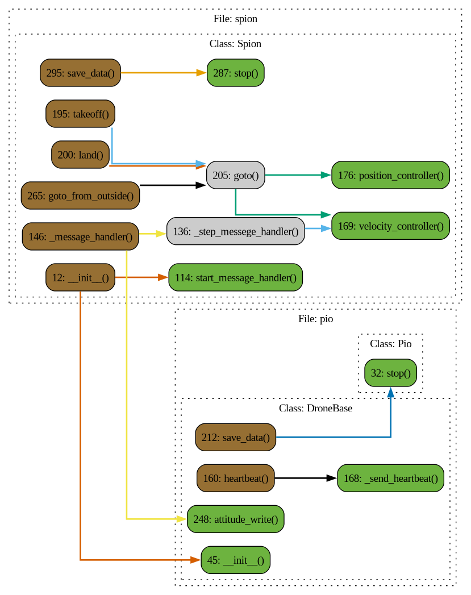

# Файл spion.py

## Класс: Spion

Описание: 

### Функция: Spion.__init__

Описание: Конструктор дочернего класса, наследующегося от Pio и Simulator.

Параметры:

- **name** 

  Описание: Имя дрона.

  Тип: None

- **mass** 

  Описание: Масса дрона.

  Тип: None

- **position** 

  Описание: Начальное состояние дрона вида [x, y, z, vx, vy, vz] или [x, y, vx, vy].Поле position имеет координаты и скорость, подобно сообщению LOCAL_POSITION_NED в mavlink.

  Тип: None

### Функция: Spion.position

Описание: Сеттер для _position

Возвращает: None

### Функция: Spion.speed

Описание: Функция вернет скорость [vx, vy, vz]

Возвращает: Union[Array2, Array3]

### Функция: Spion.start_message_handler

Описание: Запуск потока _message_handler.

### Функция: Spion.stop_message_handler

Описание: Остановка потока _message_handler.

### Функция: Spion._step_messege_handler

Описание: 

### Функция: Spion._message_handler

Описание: Основной цикл обработки сообщений.

### Функция: Spion.velocity_controller

Описание: 

### Функция: Spion.position_controller

Описание: 

### Функция: Spion.arm

Описание: 

### Функция: Spion.disarm

Описание: 

### Функция: Spion.takeoff

Описание: 

### Функция: Spion.land

Описание: 

### Функция: Spion.goto

Описание: Функция берет целевую координату и вычисляет необходимые скорости для достижения целевой позиции, посылая их вуправление t_speed.Для использования необходимо включить цикл v_while для посылки вектора скорости дрону.Максимальная скорость обрезается np.clip по полю self.max_speed.

Параметры:

- **x** 

  Описание: координата по x

  Тип: Union[float, int]

- **y** 

  Описание: координата по y:type: Union[float, int]

  Тип: None

- **z** 

  Описание:  координата по z (не используется, если self.dimension = 2):type: Union[float, int]

  Тип: None

- **yaw** 

  Описание:  координата по yaw:type: Union[float, int]

  Тип: None

- **accuracy** 

  Описание: Погрешность целевой точки:type: Union[float, int]

  Тип: None

Возвращает: None

### Функция: Spion.goto_from_outside

Описание: Функция симулятор оригинальной функции в Pion, полностью повторяет функционал goto в данном классе

Параметры:

- **x** 

  Описание: координата по x

  Тип: Union[float, int]

- **y** 

  Описание: координата по y:type: Union[float, int]

  Тип: None

- **z** 

  Описание:  координата по z:type: Union[float, int]

  Тип: None

- **yaw** 

  Описание:  координата по yaw:type: Union[float, int]

  Тип: None

- **accuracy** 

  Описание: Погрешность целевой точки:type: Union[float, int]

  Тип: None

Возвращает: None

### Функция: Spion.stop

Описание: Останавливает все потоки, завершает симуляцию

### Функция: Spion.save_data

Описание: Функция для сохранения траектории в файлcolumns=['x', 'y', 'z', 'yaw', 'Vx', 'Vy', 'Vz', 'Vy_yaw', 'vxc', 'vyc', 'vzc', 'v_yaw_c', 't']

Параметры:

- **file_name** 

  Описание: название файла:type: str

  Тип: None

- **path** 

  Описание: путь сохранения:type: str

  Тип: None

Возвращает: None

### Функция: Spion.borders

Описание: Функция накладывает границы симуляции для дрона

Возвращает: None

# Диаграмма 
 