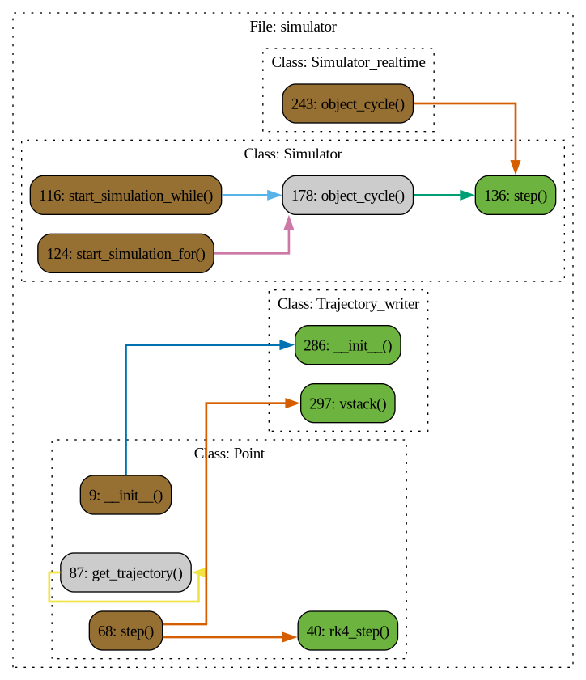

# Simulator

## Описание

### Class: Point

### Method: Point.__init__

**Описание:** Инициализация объекта Point3D

#### Параметры:

- **mass**: масса объекта
- **position**: начальная позиция объекта в пространстве [x, y, z]
- **speed**: начальная скорость объекта [vx, vy, vz]
### Method: Point.rk4_step

**Описание:** Шаг симуляции с использованием метода Рунге-Кутты 4-го порядка

#### Параметры:

- **acceleration**: вектор ускорения
- **dt**: временной шаг

#### Возвращает:
- None
### Method: Point.step

**Описание:** Шаг симуляции. Вычисляются следующие значения координат и скорости в зависимости от дискретного шага dt :param: force: сила воздействия на точку :type: Union[Array2, Array3]

#### Параметры:

- **dt**: дискретный шаг времени

#### Возвращает:
- None
### Method: Point.get_trajectory

**Описание:** Функция возвращает траекторию точки :return: NDArray[np.float64]

### Class: Simulator

**Описание:** Класс симулятора, моделирующий поведение материальной точки

### Method: Simulator.__init__

**Описание:** Класс принимает в себя массив numpy с объектами, в которых реализован метод step, принимающий dt - дискретный шаг вычисления, а также в которых есть поля speed и position. Введем локальные определения:  канал объекта - порядковый номер объекта в self.simulation_object.

### Method: Simulator.start_simulation_while

**Описание:** Функция запускает последовательную симуляцию всех симулируемых объектов :return: None :rtype: None

### Method: Simulator.start_simulation_for

**Описание:** Запускает симуляцию для всех объектов, используя цикл `for`

#### Параметры:

- **steps** (int): количество шагов симуляции

#### Возвращает:
- None
### Method: Simulator.step

**Описание:** Выполняет один шаг симуляции для объекта.

#### Параметры:

- **simulation_object** (Point): объект, который выполняет шаг симуляции
- **object_channel**: канал, соответствующий объекту в массиве simulation_objects

#### Возвращает:
- None
### Method: Simulator.set_force

**Описание:** Устанавливает силу для объекта на указанном канале.

#### Параметры:

- **force** (Union[Array2, Array3]): вектор силы, который будет применён к объекту
- **object_channel**: канал, соответствующий объекту в массиве simulation_objects

#### Возвращает:
- None
### Method: Simulator.get_position

**Описание:** Возвращает матрицу позиций всех объектов симуляции.  :return: матрица размером nx3, где n - количество объектов. Столбцы - x, y, z :rtype: np.ndarray

### Method: Simulator.object_cycle

**Описание:** Фукнция запускает симуляцию объекта.

#### Параметры:

- **type_of_cycle**: тип симуляции - while или for, если for, то нужно указать steps
- **steps**: количество шагов симуляции для цикла for

#### Возвращает:
- None
### Class: Simulator_th

**Описание:** Класс запускает симуляции в отдельных потоках.

### Method: Simulator_th.start_simulation_while

**Описание:** Функция запускает симуляцию всех объектов в self.simulation_object в отдельных потоках через цикл while с полем-флагом выключения self.simulation_turn_on :return: None :rtype: None

### Method: Simulator_th.start_simulation_for

**Описание:** Запускает симуляцию для всех объектов в отдельных потоках, используя цикл `for`.

#### Параметры:

- **steps** (int): количество шагов симуляции

#### Возвращает:
- None
### Class: Simulator_realtime

**Описание:** Класс симуляции с синхронизацией с реальным временем

### Method: Simulator_realtime.object_cycle

**Описание:** Фукнция запускает симуляцию объектов в отдельных потоках, но с синхронизацией с реальным временем.

#### Параметры:

- **type_of_cycle**: тип симуляции - while или for, если for, то нужно указать steps
- **steps**: количество шагов симуляции для цикла for

#### Возвращает:
- None
### Class: Simulator_realtime_th

**Описание:** Класс симуляции с синхронизацией в реальном времени и с запуском в отдельных потоках.

### Class: Trajectory_writer

### Method: Trajectory_writer.__init__

**Описание:** Специальный класс для записи и хранения траектории размером nx[len(list_of_names_columns)], n - количество точек.

#### Параметры:

- **list_of_names_columns**: названия колонн
### Method: Trajectory_writer.vstack

**Описание:** Функция объединяет входящие вектора с матрицей trajectory

#### Параметры:

- **vstack_array**: массив размерности len(list_of_names_columns)

#### Возвращает:
- None
### Method: Trajectory_writer.get_trajectory

**Описание:** Функция возвращает записанную траекторию :return: NDArray[np.float64] :rtype: None

### Function: __init__

**Описание:** Специальный класс для записи и хранения траектории размером nx[len(list_of_names_columns)], n - количество точек.

#### Параметры:

- **list_of_names_columns**: названия колонн
### Function: rk4_step

**Описание:** Шаг симуляции с использованием метода Рунге-Кутты 4-го порядка

#### Параметры:

- **acceleration**: вектор ускорения
- **dt**: временной шаг

#### Возвращает:
- None
### Function: step

**Описание:** Выполняет один шаг симуляции для объекта.

#### Параметры:

- **simulation_object** (Point): объект, который выполняет шаг симуляции
- **object_channel**: канал, соответствующий объекту в массиве simulation_objects

#### Возвращает:
- None
### Function: get_trajectory

**Описание:** Функция возвращает записанную траекторию :return: NDArray[np.float64] :rtype: None

### Function: start_simulation_while

**Описание:** Функция запускает симуляцию всех объектов в self.simulation_object в отдельных потоках через цикл while с полем-флагом выключения self.simulation_turn_on :return: None :rtype: None

### Function: start_simulation_for

**Описание:** Запускает симуляцию для всех объектов в отдельных потоках, используя цикл `for`.

#### Параметры:

- **steps** (int): количество шагов симуляции

#### Возвращает:
- None
### Function: set_force

**Описание:** Устанавливает силу для объекта на указанном канале.

#### Параметры:

- **force** (Union[Array2, Array3]): вектор силы, который будет применён к объекту
- **object_channel**: канал, соответствующий объекту в массиве simulation_objects

#### Возвращает:
- None
### Function: get_position

**Описание:** Возвращает матрицу позиций всех объектов симуляции.  :return: матрица размером nx3, где n - количество объектов. Столбцы - x, y, z :rtype: np.ndarray

### Function: object_cycle

**Описание:** Фукнция запускает симуляцию объектов в отдельных потоках, но с синхронизацией с реальным временем.

#### Параметры:

- **type_of_cycle**: тип симуляции - while или for, если for, то нужно указать steps
- **steps**: количество шагов симуляции для цикла for

#### Возвращает:
- None
### Function: vstack

**Описание:** Функция объединяет входящие вектора с матрицей trajectory

#### Параметры:

- **vstack_array**: массив размерности len(list_of_names_columns)

#### Возвращает:
- None

 Диаграмма потока

 