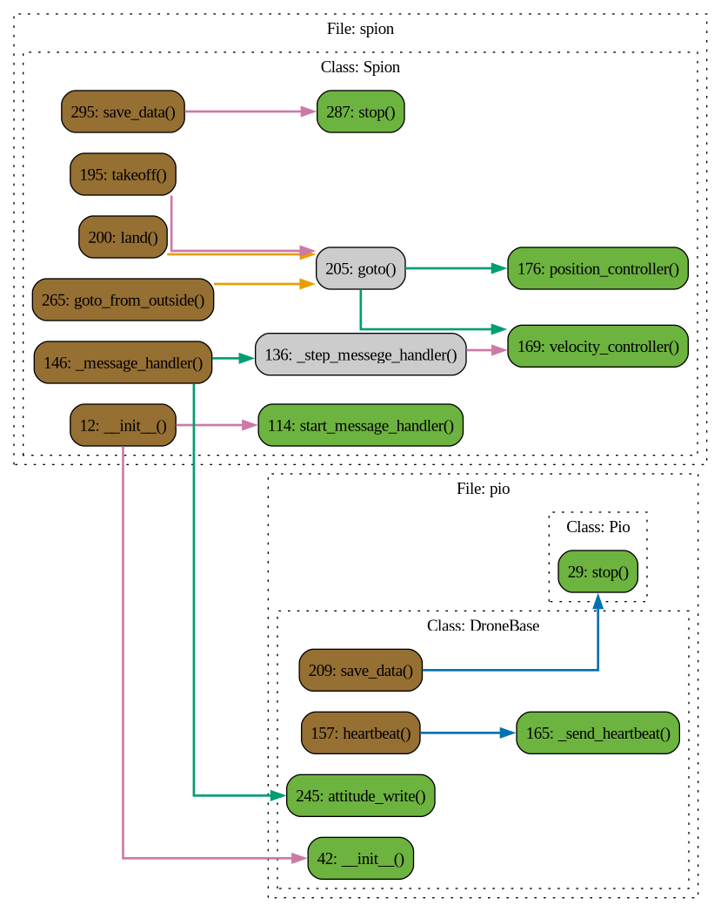

# Spion

## Описание

### Class: Spion

### Method: Spion.__init__

**Описание:** Конструктор дочернего класса, наследующегося от Pio и Simulator.

#### Параметры:

- **name**: Имя дрона.
- **mass**: Масса дрона.
- **position**: Начальное состояние дрона вида [x, y, z, vx, vy, vz] или [x, y, vx, vy].
### Method: Spion.position

**Описание:** Сеттер для _position :return: None

### Method: Spion.speed

**Описание:** Функция вернет скорость [vx, vy, vz] :return: Union[Array2, Array3]

### Method: Spion.start_message_handler

**Описание:** Запуск потока _message_handler.

### Method: Spion.stop_message_handler

**Описание:** Остановка потока _message_handler.

### Method: Spion._step_messege_handler

### Method: Spion._message_handler

**Описание:** Основной цикл обработки сообщений.

### Method: Spion.velocity_controller

### Method: Spion.position_controller

### Method: Spion.arm

### Method: Spion.disarm

### Method: Spion.takeoff

### Method: Spion.land

### Method: Spion.goto

**Описание:** Функция берет целевую координату и вычисляет необходимые скорости для достижения целевой позиции, посылая их в управление t_speed. Для использования необходимо включить цикл v_while для посылки вектора скорости дрону. Максимальная скорость обрезается np.clip по полю self.max_speed.

#### Параметры:

- **x** (Union[float, int]): координата по x
- **y**: координата по y
- **z**: координата по z (не используется, если self.dimension = 2)
- **yaw**: координата по yaw
- **accuracy**: Погрешность целевой точки 
### Method: Spion.goto_from_outside

**Описание:** Функция симулятор оригинальной функции в Pion, полностью повторяет функционал goto в данном классе

#### Параметры:

- **x** (Union[float, int]): координата по x
- **y**: координата по y
- **z**: координата по z
- **yaw**: координата по yaw
- **accuracy**: Погрешность целевой точки
### Method: Spion.stop

**Описание:** Останавливает все потоки, завершает симуляцию

### Method: Spion.save_data

**Описание:** Функция для сохранения траектории в файл columns=['x', 'y', 'z', 'yaw', 'Vx', 'Vy', 'Vz', 'Vy_yaw', 'vxc', 'vyc', 'vzc', 'v_yaw_c', 't']

#### Параметры:

- **file_name**: название файла
- **path**: путь сохранения
### Method: Spion.borders

**Описание:** Функция накладывает границы симуляции для дрона :return: None

### Function: __init__

**Описание:** Конструктор дочернего класса, наследующегося от Pio и Simulator.

#### Параметры:

- **name**: Имя дрона.
- **mass**: Масса дрона.
- **position**: Начальное состояние дрона вида [x, y, z, vx, vy, vz] или [x, y, vx, vy].
### Function: position

**Описание:** Сеттер для _position :return: None

### Function: speed

**Описание:** Функция вернет скорость [vx, vy, vz] :return: Union[Array2, Array3]

### Function: start_message_handler

**Описание:** Запуск потока _message_handler.

### Function: stop_message_handler

**Описание:** Остановка потока _message_handler.

### Function: _step_messege_handler

### Function: _message_handler

**Описание:** Основной цикл обработки сообщений.

### Function: velocity_controller

### Function: position_controller

### Function: arm

### Function: disarm

### Function: takeoff

### Function: land

### Function: goto

**Описание:** Функция берет целевую координату и вычисляет необходимые скорости для достижения целевой позиции, посылая их в управление t_speed. Для использования необходимо включить цикл v_while для посылки вектора скорости дрону. Максимальная скорость обрезается np.clip по полю self.max_speed.

#### Параметры:

- **x** (Union[float, int]): координата по x
- **y**: координата по y
- **z**: координата по z (не используется, если self.dimension = 2)
- **yaw**: координата по yaw
- **accuracy**: Погрешность целевой точки 
### Function: goto_from_outside

**Описание:** Функция симулятор оригинальной функции в Pion, полностью повторяет функционал goto в данном классе

#### Параметры:

- **x** (Union[float, int]): координата по x
- **y**: координата по y
- **z**: координата по z
- **yaw**: координата по yaw
- **accuracy**: Погрешность целевой точки
### Function: stop

**Описание:** Останавливает все потоки, завершает симуляцию

### Function: save_data

**Описание:** Функция для сохранения траектории в файл columns=['x', 'y', 'z', 'yaw', 'Vx', 'Vy', 'Vz', 'Vy_yaw', 'vxc', 'vyc', 'vzc', 'v_yaw_c', 't']

#### Параметры:

- **file_name**: название файла
- **path**: путь сохранения
### Function: borders

**Описание:** Функция накладывает границы симуляции для дрона :return: None

 Диаграмма потока

 