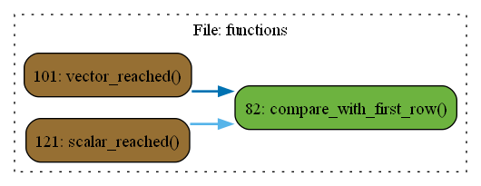

# Файл functions.py

### Функция: create_connection

Описание: Создаёт MAVLink соединение.

Параметры:

- **connection_method** 

  Описание: Метод соединения, например, 'udp', 'tcp', или другой.

  Тип: str

- **ip** 

  Описание: IP-адрес для соединения, например '127.0.0.1'

  Тип: str

- **port** 

  Описание: Порт для соединения. Может быть целым числом или строкой.

  Тип: Union[int, str]

Возвращает: Возвращает объект mav_socket, который представляет MAVLink соединение.

Тип возвращаемого объекта: mavutil.mavfile

### Функция: update_array

Описание: Сдвигает элементы массива и вставляет новое значение в начало.

Параметры:

- **arr** 

  Описание: Входной массив или список для обновления. Может быть списком,numpy-массивом с числами типа float, либо вложенной структуройиз списков или массивов.

  Тип: Union[list, npt.NDArray[Union[float, list, npt.NDArray[np.float64]]]]

- **new_value** 

  Описание: Значение, которое будет помещено в начало массива.

  Тип: Union[float, list, npt.NDArray[np.float64]]

Возвращает: Обновлённый массив с новым значением в начале.

Тип возвращаемого объекта: Union[list, npt.NDArray[np.float64]]

### Функция: update_vector

Описание: Сдвигает элементы вектора и вставляет новое значение (скаляр) в начало.

Параметры:

- **vector** 

  Описание: Входной вектор для обновления. Может быть списком или numpy-массивом с числами типа float.

  Тип: Union[list, npt.NDArray[np.float64]]

- **new_value** 

  Описание: Скалярное значение, которое будет помещено в начало вектора.

  Тип: float

Возвращает: Обновлённый вектор с новым значением в начале.

Тип возвращаемого объекта: npt.NDArray[np.float64]

### Функция: compare_with_first_row

Описание: Проверяет, являются ли все строки матрицы близкими к первой строке в пределах допуска.

Параметры:

- **matrix** 

  Описание: Входная матрица, представленная списком или numpy-массивом.

  Тип: Union[list, npt.NDArray[np.float64]]

- **atol** 

  Описание: Абсолютная погрешность для сравнения строк. Значение по умолчанию равно 1e-2.

  Тип: float

Возвращает: Возвращает True, если все строки матрицы близки к первой строке в пределах указанной погрешности, иначе False.

Тип возвращаемого объекта: bool

### Функция: vector_reached

Описание: Функция сравнивает текующую позицию с целевой позицией, возвращает True в пределах погрешности accuracy

Параметры:

- **target_vector** 

  Описание: целевой вектор:type: Union[list, npt.NDArray[np.float64]]

  Тип: None

- **current_point_matrix** 

  Описание: текущий вектор состояния дрона:type: Union[list, npt.NDArray[np.ndarray]]

  Тип: None

- **accuracy** 

  Описание: Погрешность целевой точки:type: Union[int, float]

  Тип: None

Возвращает: bool

### Функция: scalar_reached

Описание: Функция сравнивает текующую позицию с целевой позицией, возвращает True в пределах погрешности accuracy

Параметры:

- **target_vector** 

  Описание: целевой вектор:type: Union[list, npt.NDArray[np.float64]]

  Тип: None

- **current_point_matrix** 

  Описание: текущий вектор состояния дрона:type: Union[list, npt.NDArray[np.ndarray]]

  Тип: None

- **accuracy** 

  Описание: Погрешность целевой точки:type: Union[int, float]

  Тип: None

Возвращает: bool

# Диаграмма 
 