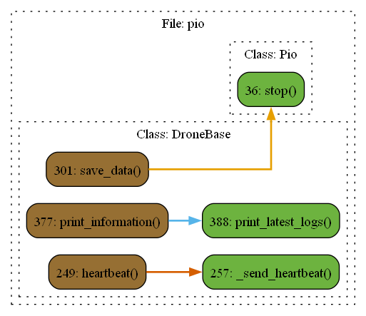

# Файл pio.py

## Класс: Pio

Описание: Абстрактный класс Pio с важными методами для дрона

### Функция: Pio.arm

Описание: 

### Функция: Pio.disarm

Описание: 

### Функция: Pio.takeoff

Описание: 

### Функция: Pio.land

Описание: 

### Функция: Pio.set_v

Описание: 

### Функция: Pio.stop

Описание: 

### Функция: Pio._send_heartbeat

Описание: Отправляет сообщение HEARTBEAT для поддержания активного соединения с дроном.

Возвращает: None

## Класс: DroneBase

Описание: Абстрактный класс с частичной реализацией методов, служит для сокращения кода в дочерних классах

### Функция: DroneBase.__init__

Описание: 

Параметры:

- **ip** 

  Описание: IP-адрес для подключения к дрону

  Тип: str

- **mavlink_port** 

  Описание: Порт для MAVLink соединения.

  Тип: int

- **count_of_checking_points** 

  Описание: Количество последних точек, используемых для проверки достижения цели.

  Тип: int

- **name** 

  Описание: Название экземпляра

  Тип: str

- **mass** 

  Описание: Масса дрона

  Тип: float

- **dimension** 

  Описание: Размерность дрона, возможные значения: 2, 3

  Тип: int

- **position** 

  Описание: Начальное состояние дрона вида [x, y, z, vx, vy, vz] или [x, y, vx, vy]

  Тип: Union[Array6, Array4, None]

- **attitude** 

  Описание: Начальное состояние дрона вида [roll, pitch, yaw, v_roll, v_pitch, v_yaw]

  Тип: Union[Array6, None]

- **dt** 

  Описание: Период приема всех сообщений с дрона или шаг времени в симуляции в Spion

  Тип: float

- **logger** 

  Описание: Включить логирование

  Тип: bool

- **checking_components** 

  Описание: Параметр для проверки номеров компонентов. Отключается для в сторонних симуляторахво избежание ошибок.

  Тип: bool

- **accuracy** 

  Описание: Максимальное отклонение от целевой позиции для функции goto_from_outside

  Тип: float

- **max_speed** 

  Описание: Максимальная скорость дрона в режиме управления по скорости

  Тип: float

### Функция: DroneBase.position

Описание: Сеттер для _position

Возвращает: None

### Функция: DroneBase.xyz

Описание: Сеттер для _position

Возвращает: None

### Функция: DroneBase.yaw

Описание: Геттер вернет yaw

Возвращает: np.ndarray

### Функция: DroneBase.attitude

Описание: Сеттер для _attitude

Возвращает: None

### Функция: DroneBase.arm

Описание: Включает двигатели

Возвращает: None

### Функция: DroneBase.disarm

Описание: Отключает двигатели

Возвращает: None

### Функция: DroneBase.takeoff

Описание: Взлет дрона

Возвращает: None

### Функция: DroneBase.land

Описание: Посадка дрона

Возвращает: None

### Функция: DroneBase.heartbeat

Описание: Функция проверки heartbeat дрона

Возвращает: None

### Функция: DroneBase._send_heartbeat

Описание: Отправляет сообщение HEARTBEAT для поддержания активного соединения с дроном.

Возвращает: None

### Функция: DroneBase.goto_yaw

Описание: Берет целевую координату по yaw и вычисляет необходимые скорости для достижения целевой позиции, посылая их в управление t_speed.Для использования необходимо включить цикл v_while для посылки вектора скорости дрону.Максимальная скорость обрезается np.clip по полю self.max_speed.

Параметры:

- **yaw** 

  Описание:  координата по yaw (радианы):type: Union[float, int]

  Тип: None

- **accuracy** 

  Описание: Погрешность целевой точки:type: Union[float, int]

  Тип: None

Возвращает: None

### Функция: DroneBase.led_control

Описание: Управление светодиодами на дроне.

Параметры:

- **led_id** 

  Описание: Идентификатор светодиода, который нужно управлять. Допустимые значения: 0, 1, 2, 3, 255.255 — для управления всеми светодиодами одновременно.

  Тип: int

- **r** 

  Описание: Значение интенсивности красного канала (от 0 до 255).

  Тип: int

- **g** 

  Описание: Значение интенсивности зеленого канала (от 0 до 255).

  Тип: int

- **b** 

  Описание: Значение интенсивности синего канала (от 0 до 255).:raises ValueError: Если переданы недопустимые значения для параметра led_id или для значений r, g, b.

  Тип: int

Возвращает: None

### Функция: DroneBase.save_data

Описание: Функция для сохранения траектории в файлcolumns=['x', 'y', 'z', 'vx', 'vy', 'yaw', 'pitch', 'roll','Vyaw', 'Vpitch', 'Vroll', 'vxc', 'vyc', 'vzc', 'v_yaw_c', 't']

Параметры:

- **file_name** 

  Описание: название файла:type: str

  Тип: None

- **path** 

  Описание: путь сохранения:type: str

  Тип: None

Возвращает: None

### Функция: DroneBase.check_battery

Описание: Проверяет статус батареи

Возвращает: None

### Функция: DroneBase.reboot_board

Описание: Функция для перезагрузки дрона

Возвращает: None

### Функция: DroneBase.attitude_write

Описание: Функция для записи траектории в numpy массив. Записывается только уникальная координата:return:

### Функция: DroneBase.set_v

Описание: Создает поток, который вызывает функцию v_while() для параллельной отправки вектора скорости

Возвращает: None

### Функция: DroneBase.position_controller

Описание: Фнкция формирования управляющего сигнала в сторону position_xyz

Параметры:

- **position_xyz** 

  Описание: Целевая координата

  Тип: Union[Array3, Array2]

- **dt** 

  Описание: шаг времени расчета

  Тип: float

Возвращает: None

Тип возвращаемого объекта: None

### Функция: DroneBase.print_information

Описание: Функция обновляет словарь с логами self.logs

Возвращает: None

### Функция: DroneBase.print_latest_logs

Описание: Функция обновляет результаты в таблице логов

Параметры:

- **log_dict** 

  Описание: Словарь с логами заполнения таблицы

  Тип: dict

- **n** 

  Описание: Количество логов из словаря, которые попадут в таблицу

  Тип: int

- **name** 

  Описание: Заголовок таблицы

  Тип: str

Возвращает: None

### Функция: DroneBase.detect

Описание: Метод детектирования (чего-либо)

# Диаграмма 
 