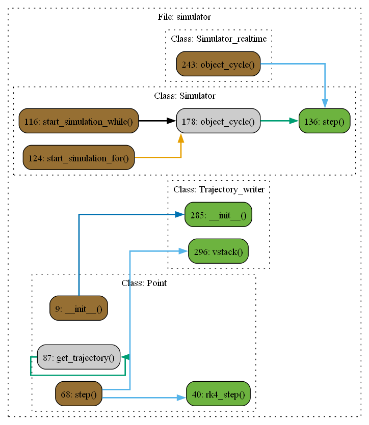

# Файл simulator.py

## Класс: Point

Описание:

### Функция: Point.__init__

Описание: Инициализация объекта Point3D

Параметры:

- **mass**

  Описание: масса объекта:type: Union[Array2, Array3]

  Тип: None

- **position**

  Описание: начальная позиция объекта в пространстве [x, y, z]:type: Union[Array2, Array3]

  Тип: None

- **speed**

  Описание: начальная скорость объекта [vx, vy, vz]:type: Union[Array2, Array3]:trajectory_write: записывать ли траекторию:type: bool

  Тип: None

### Функция: Point.rk4_step

Описание: Шаг симуляции с использованием метода Рунге-Кутты 4-го порядка

Параметры:

- **acceleration**

  Описание: вектор ускорения:type: Union[Array2, Array3]

  Тип: None

- **dt**

  Описание: временной шаг:type: float

  Тип: None

Возвращает: None

Тип возвращаемого объекта: None

### Функция: Point.step

Описание: Шаг симуляции. Вычисляются следующие значения координат и скорости в зависимости от дискретного шага dt:param: force: сила воздействия на точку:type: Union[Array2, Array3]

Параметры:

- **dt**

  Описание: дискретный шаг времени:type: float

  Тип: None

Возвращает: None

Тип возвращаемого объекта: None

### Функция: Point.get_trajectory

Описание: Функция возвращает траекторию точки

Возвращает: NDArray[np.float64]

## Класс: Simulator

Описание: Класс симулятора, моделирующий поведение материальной точки

### Функция: Simulator.__init__

Описание: Класс принимает в себя массив numpy с объектами, в которых реализован метод step, принимающий dt - дискретныйшаг вычисления, а также в которых есть поля speed и position.Введем локальные определения:канал объекта - порядковый номер объекта в self.simulation_object.

### Функция: Simulator.start_simulation_while

Описание: Функция запускает последовательную симуляцию всех симулируемых объектов

Возвращает: None

Тип возвращаемого объекта: None

### Функция: Simulator.start_simulation_for

Описание: Запускает симуляцию для всех объектов, используя цикл `for`

Параметры:

- **steps**

  Описание: количество шагов симуляции

  Тип: int

Возвращает: None

Тип возвращаемого объекта: None

### Функция: Simulator.step

Описание: Выполняет один шаг симуляции для объекта.

Параметры:

- **simulation_object**

  Описание: объект, который выполняет шаг симуляции

  Тип: Point

- **object_channel**

  Описание: канал, соответствующий объекту в массиве simulation_objects

  Тип: int

Возвращает: None

Тип возвращаемого объекта: None

### Функция: Simulator.set_force

Описание: Устанавливает силу для объекта на указанном канале.

Параметры:

- **force**

  Описание: вектор силы, который будет применён к объекту

  Тип: Union[Array2, Array3]

- **object_channel**

  Описание: канал, соответствующий объекту в массиве simulation_objects

  Тип: int

Возвращает: None

Тип возвращаемого объекта: None

### Функция: Simulator.get_position

Описание: Возвращает матрицу позиций всех объектов симуляции.

Возвращает: матрица размером nx3, где n - количество объектов. Столбцы - x, y, z

Тип возвращаемого объекта: np.ndarray

### Функция: Simulator.object_cycle

Описание: Фукнция запускает симуляцию объекта.

Параметры:

- **type_of_cycle**

  Описание: тип симуляции - while или for, если for, то нужно указать steps:type: str

  Тип: None

- **steps**

  Описание: количество шагов симуляции для цикла for

  Тип: None

Возвращает: None

Тип возвращаемого объекта: None

## Класс: Simulator_th

Описание: Класс запускает симуляции в отдельных потоках.

### Функция: Simulator_th.start_simulation_while

Описание: Функция запускает симуляцию всех объектов в self.simulation_object в отдельных потокахчерез цикл while с полем-флагом выключения self.simulation_turn_on

Возвращает: None

Тип возвращаемого объекта: None

### Функция: Simulator_th.start_simulation_for

Описание: Запускает симуляцию для всех объектов в отдельных потоках, используя цикл `for`.

Параметры:

- **steps**

  Описание: количество шагов симуляции

  Тип: int

Возвращает: None

Тип возвращаемого объекта: None

## Класс: Simulator_realtime

Описание: Класс симуляции с синхронизацией с реальным временем

### Функция: Simulator_realtime.object_cycle

Описание: Фукнция запускает симуляцию объектов в отдельных потоках, но ссинхронизацией с реальным временем.

Параметры:

- **type_of_cycle**

  Описание: тип симуляции - while или for, если for, то нужно указать steps:type: str

  Тип: None

- **steps**

  Описание: количество шагов симуляции для цикла for

  Тип: None

Возвращает: None

Тип возвращаемого объекта: None

## Класс: Simulator_realtime_th

Описание: Класс симуляции с синхронизацией в реальном времени и с запуском в отдельных потоках.

## Класс: Trajectory_writer

Описание:

### Функция: Trajectory_writer.__init__

Описание: Специальный класс для записи и хранения траектории размеромnx[len(list_of_names_columns)], n - количество точек.

Параметры:

- **list_of_names_columns**

  Описание: названия колонн:type: Union[list[str], NDArray[str]]

  Тип: None

### Функция: Trajectory_writer.vstack

Описание: Функция объединяет входящие вектора с матрицей trajectory

Параметры:

- **vstack_array**

  Описание: массив размерности len(list_of_names_columns):type: NDArray[Any]

  Тип: None

Возвращает: None

Тип возвращаемого объекта: None

### Функция: Trajectory_writer.get_trajectory

Описание: Функция возвращает записанную траекторию

Возвращает: NDArray[np.float64]

Тип возвращаемого объекта: None

# Диаграмма
 
