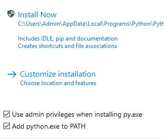
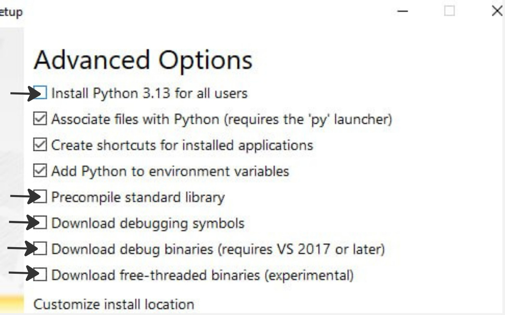
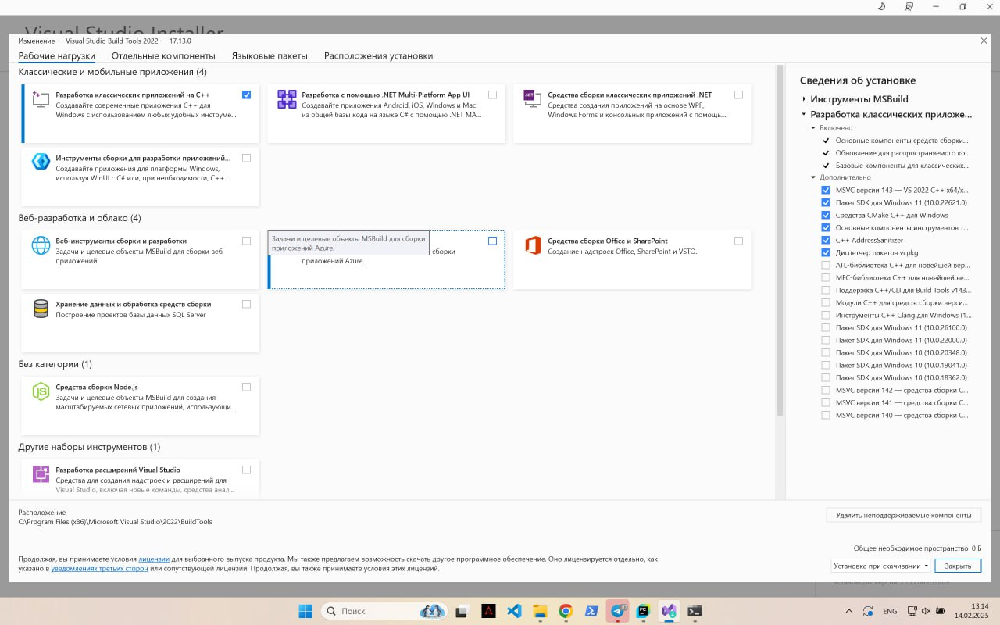

Установка на windows
====================

Автоматическая установка
------------------------

Перейдите в папку со своим проектом через терминал и выполните команду

.. code-block:: powershell

    powershell -NoProfile -ExecutionPolicy Bypass -Command "Invoke-WebRequest 'https://raw.githubusercontent.com/OnisOris/pion/refs/heads/dev/install_scripts/install_windows.bat' -OutFile 'install_windows.bat'; Start-Process 'install_windows.bat' -Verb RunAs"

Данная команда установит все необходимые библиотеки для сборки модуля

Ручная установка
----------------

Установите python. Тесты проводились на версиях 3.9-3.13, но рекомендую ставить >3.13.
Важно, если у вас установлен python, проверьте, что необходимые библиотеки у вас есть, если же вы не уверены, переустановите
python по инструкции.

* `Последняя версия python <https://www.python.org/downloads/>`_

Далее при установке поставьте галки, как на картинках, а также перейдите в Customize installation.

Доставьте все галки в "Advanced Options"

Здесь тоже доставьте галки

.. image:: img/python_install3.jpg
    :width: 750
    :align: center
    :target: img/python_install3.jpg
    :alt: окно установки 3

Проверьте, что у вас установлен vs build tools с нужными пакетами:

Создание вирутального окружения
-------------------------------

В терминале перейдите в ваш проект и выполните команду:

.. code-block:: bash

   python -m venv venv

После этого активируйте виртуальное окружение:

.. code-block:: powershell

   venv\Scripts\activate.bat
