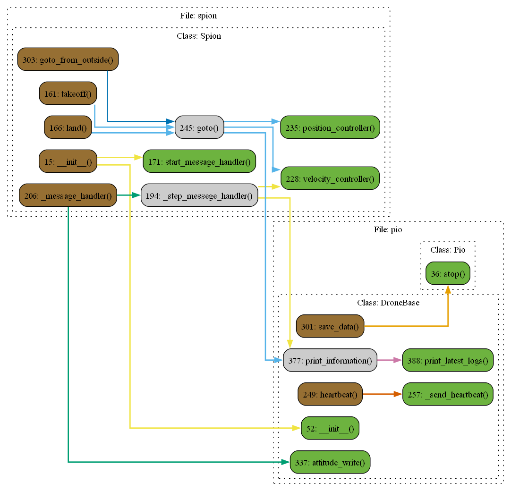

# Файл spion.py

## Класс: Spion

Описание: Класс симулятор, повторяющий действия Pion в симуляции математической модели точки

### Функция: Spion.__init__

Описание: Конструктор дочернего класса, наследующегося от Pio и Simulator

Параметры:

- **ip**

  Описание: IP-адрес для подключения к дрону

  Тип: str

- **mavlink_port**

  Описание: Порт для MAVLink соединения

  Тип: int

- **connection_method**

  Описание: Метод соединения, например, 'udpout' для MAVLink.

  Тип: str

- **position**

  Описание: Начальное состояние дрона вида [x, y, z, vx, vy, vz] или [x, y, vx, vy]

  Тип: Union[Array6, Array4, None]

- **attitude**

  Описание: Начальное состояние дрона вида [roll, pitch, yaw, v_roll, v_pitch, v_yaw]

  Тип: Union[Array6, None]

- **combine_system**

  Описание: Системный код для комбинированной системы управления: 1, 2, 3

  Тип: int

- **count_of_checking_points**

  Описание: Количество последних точек, используемых для проверки достижения цели.

  Тип: int

- **name**

  Описание: Название экземпляра

  Тип: str

- **mass**

  Описание: Масса дрона

  Тип: float

- **dt**

  Описание: Период приема всех сообщений с дрона

  Тип: float

- **logger**

  Описание: Включить логирование

  Тип: bool

- **checking_components**

  Описание: Параметр для проверки номеров компонентов. Отключается для в сторонних симуляторахво избежание ошибок

  Тип: bool

- **accuracy**

  Описание: Максимальное отклонение от целевой позиции для функции goto_from_outside

  Тип: float

- **max_speed**

  Описание: Максимальная скорость дрона в режиме управления по скорости

  Тип: float

- **start_message_handler_from_init**

  Описание: Старт message handler при создании объекта

  Тип: bool

- **dimension**

  Описание: Размерность дрона, возможные значения: 2, 3

  Тип: int

### Функция: Spion.position

Описание: Сеттер для _position

Возвращает: None

### Функция: Spion.speed

Описание: Функция вернет скорость [vx, vy, vz]

Возвращает: Union[Array2, Array3]

### Функция: Spion.takeoff

Описание:

### Функция: Spion.land

Описание:

### Функция: Spion.start_message_handler

Описание: Запуск потока _message_handler

### Функция: Spion.stop_message_handler

Описание: Остановка потока _message_handler

### Функция: Spion._step_messege_handler

Описание:

### Функция: Spion._message_handler

Описание: Основной цикл обработки сообщений.

### Функция: Spion.velocity_controller

Описание:

### Функция: Spion.position_controller

Описание:

### Функция: Spion.goto

Описание: Функция берет целевую координату и вычисляет необходимые скорости для достижения целевой позиции, посылая их вуправление t_speed.Для использования необходимо включить цикл v_while для посылки вектора скорости дрону.Максимальная скорость обрезается np.clip по полю self.max_speed

Параметры:

- **x**

  Описание: координата по x

  Тип: Union[float, int]

- **y**

  Описание: координата по y:type: Union[float, int]

  Тип: None

- **z**

  Описание:  координата по z (не используется, если self.dimension = 2):type: Union[float, int]

  Тип: None

- **yaw**

  Описание:  координата по yaw:type: Union[float, int]

  Тип: None

- **accuracy**

  Описание: Погрешность целевой точки:type: Union[float, int]

  Тип: None

Возвращает: None

### Функция: Spion.goto_from_outside

Описание: Функция симулятор оригинальной функции в Pion, полностью повторяет функционал goto в данном классе

Параметры:

- **x**

  Описание: координата по x

  Тип: Union[float, int]

- **y**

  Описание: координата по y:type: Union[float, int]

  Тип: None

- **z**

  Описание:  координата по z:type: Union[float, int]

  Тип: None

- **yaw**

  Описание:  координата по yaw:type: Union[float, int]

  Тип: None

- **accuracy**

  Описание: Погрешность целевой точки:type: Union[float, int]

  Тип: None

Возвращает: None

### Функция: Spion.stop

Описание: Останавливает все потоки, завершает симуляцию

### Функция: Spion.borders

Описание: Функция накладывает границы симуляции для дрона

Возвращает: None

# Диаграмма
 
